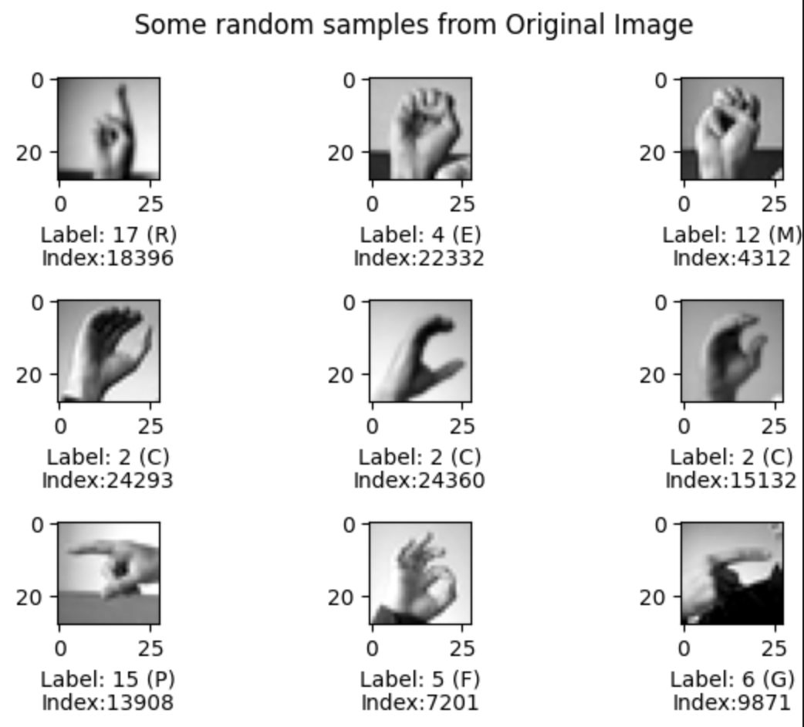
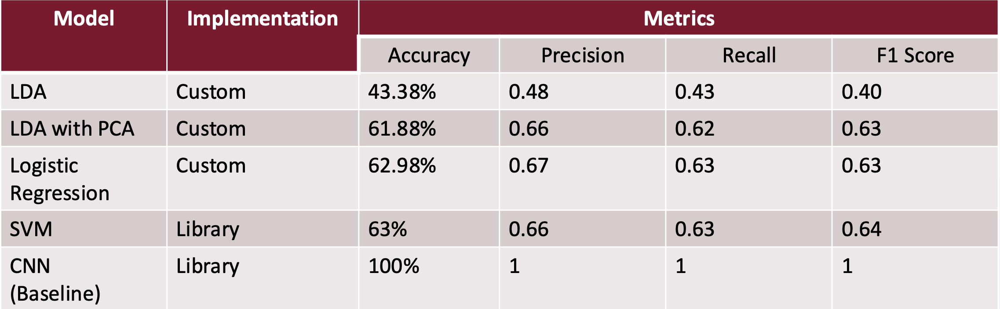

I am solving the classification of MINST (Modified National Institute of Standards and Technology) dataset for sign language. 

It was a Individual Course Project for the subject Pattern Recognition.

I am using the MNIST from Kaggle.Link to the dataset: https://www.kaggle.com/datasets/datamunge/sign-language-mnist

About the Data:

It consists of all the American Sign Language

For this ML Task, I am using making omy own custom classification models without using any third party libraries. I am working with 
1. Logistic regression
2. LDA (Linear Discriminant Analysis)
3. LDA with PCA (Principal Component Analysis)
4. SVM (Support Vector Machine)
5. CNN (Convolutional Neural Network)

 These algorithms are used for multiclass classifciation. However, I have used sk learn to visualize the data. To compare between these models I have taken following metrices:

The project structure is as follows:
# Entry point :
It has the loading of dataset and basic visiulization of initial data. 

Each File has a name of Custom_ and model assinged to it. 

Qualitative Analysis is the part where I ran my custom images and made the model predict the outcome.

## To run the code. 
Clone the repo. You need to also download the dataset from Kaggel: https://www.kaggle.com/datasets/datamunge/sign-language-mnist inside this repo. You can run the individual model to get the custom classification. 

Happy Coding! 