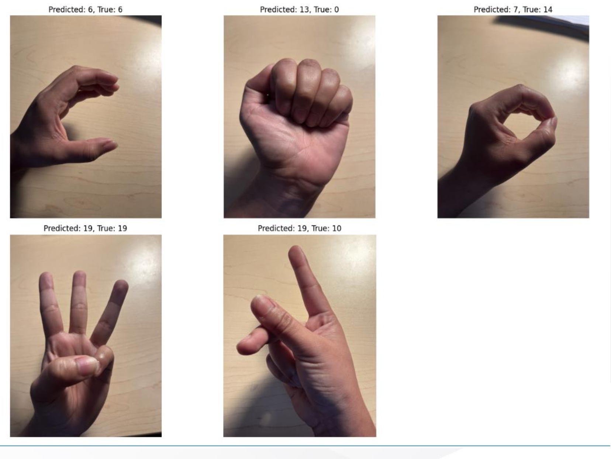

# MNIST Classification for Sign Language Recognition

This project tackles the classification of the **MNIST Sign Language dataset** as a part of an individual course project for the subject **Pattern Recognition**, a graduate course for Florida Institute of Technology.

---

## Dataset Information
The dataset used is the **Sign Language MNIST** from Kaggle, which includes representations of all American Sign Language characters. [Link to the dataset](https://www.kaggle.com/datasets/datamunge/sign-language-mnist).

### Data Preview:


---

## Machine Learning Task

The goal is to classify American Sign Language characters using custom-built classification models. The following algorithms are implemented from scratch (without using third-party libraries):

1. **Logistic Regression**
2. **Linear Discriminant Analysis (LDA)**
3. **LDA with Principal Component Analysis (PCA)**
4. **Support Vector Machine (SVM)**
5. **Convolutional Neural Network (CNN)**

For visualization and data exploration, **scikit-learn** has been used. The task involves **multiclass classification**, and the models are compared using specific performance metrics:

### Comparison Metrics:


---

## Project Structure

### **Entry Point**
The entry point script handles dataset loading and initial data visualization.

### **Custom Models**
Each algorithm is implemented in a separate file prefixed with `Custom_` followed by the model name.

### **Qualitative Analysis**
A separate section is dedicated to qualitative analysis, where custom images are fed into the models to predict outcomes. Example results:


---

## Video Presentation
You can watch a detailed presentation of the project here:

<iframe width="560" height="315" src="https://www.youtube.com/embed/dXkr6J9Cu3w" title="YouTube video player" frameborder="0" allow="accelerometer; autoplay; clipboard-write; encrypted-media; gyroscope; picture-in-picture" allowfullscreen></iframe>

---

## Setting Up the Environment

Follow the steps below to set up the virtual environment and install required dependencies:

### Step 1: Clone the Repository
```bash
git clone <repository-url>
cd <repository-folder>
